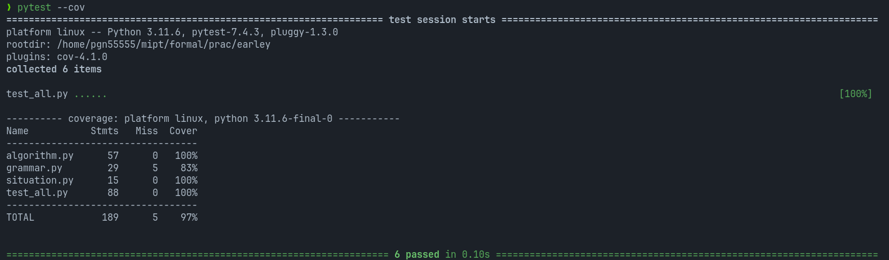

# Алгоритм Эрли

## Запуск программы

Сначала склонируйте репозиторий:

```bash
git clone https://gitlab.akhcheck.ru/maksim.ivanov/earley-parser.git
```

*Следующие команды надо выполнять из папки проекта.*

Установите необходимые компоненты:

```bash
pip3 install -r requirements.txt
```

### Ввод с клавиатуры

Можно запустить реализованный ввод с клавиатуры:

```bash
python3 input.py
```

### Использование в проекте

Программа реализована как отдельная библиотека Python. Для использования сначала импортируйте необходимые модули:

```python
from grammar import Grammar
from algorithm import EarleyParser
```

Далее сконфигурируйте грамматику:

```python
grammar = Grammar(number_not_terminals: int, number_terminals: int, number_rules: int)
grammar.add_not_terminal(symbols: str) # concatenated string of capital letters
grammar.add_terminal(symbols: str) # concatenated string of symbols
grammar.add_rule(rule: str) # format "left -> right" 
...
grammar.add_rule(rule: str)
grammar.add_start(symbols: str) # one start not terminal
```

Сконфигурируйте парсер:

```python
parser = EarleyParser()
parser.fit(grammar)
```

Запустите программу следующей командой:

```bash
python3 name.py # name.py - name of your program
```

## Тесты

Тесты запускаются следующей командой:

```bash
pytest --cov
```
Результаты тестирования:


